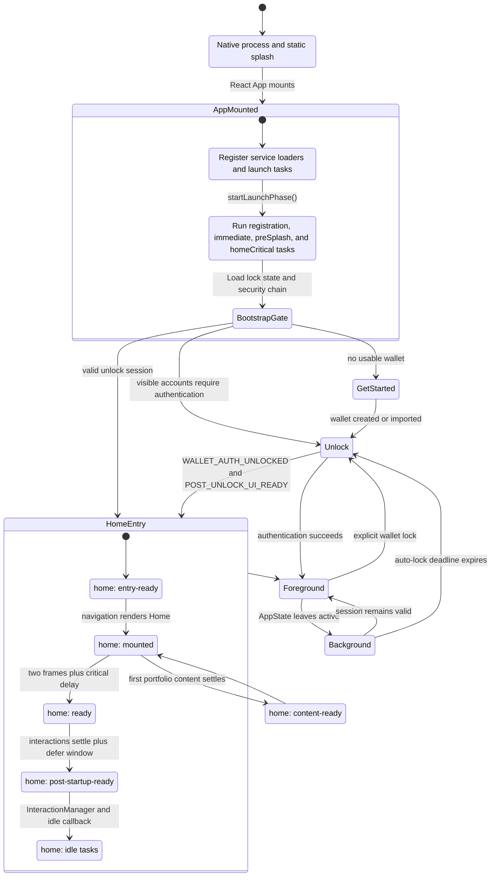
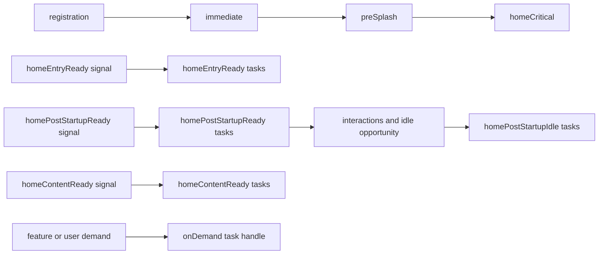
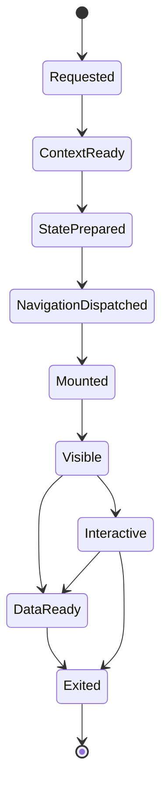

# Rabby Mobile App Lifecycle

This document describes the lifecycle currently implemented by Rabby Mobile.
It separates one-shot application startup from repeatable feature activation
cycles so that startup work is not accidentally attached to screen renders.

## Application lifecycle

`home: content-ready` is an independent data milestone. It may be observed
before or after `home: post-startup-ready`; neither event should wait for the
other. The static/animated splash is hidden by its own native and React
handoff, while startup work is scheduled by milestones rather than by keeping
the first screen hidden.

## Startup task scheduling

The first four task classes execute as part of the launch phase. The milestone
classes wait for their named signal. `homePostStartupIdle` additionally waits
for interactions and an idle opportunity, while `onDemand` does not run until
its owner explicitly invokes the returned handle.

## Repeatable feature activation cycle

Startup phases advance once per process launch. A feature visit is different:
each visit creates a new cycle and a later visit must not reuse the prior
cycle's completion state.

The diagnostic event vocabulary is shared by Swap, Bridge, Single Address,
and Gas Account. A feature may become interactive before remote data is ready;
network waiting must not be reported as synchronous JS-thread work. Starting a
new cycle supersedes an unfinished cycle for the same feature.

## State ownership rules

- `App.tsx` starts the launch phase; it must not become a list of business
  initializers.
- `useBootstrapApp` owns the render gate and initial route inputs: lock state,
  unlock-session validity, visible accounts, stored keyrings, and security
  chain readiness.
- `AppNavigation` chooses Get Started, Unlock, or Home from the bootstrapped
  state.
- Home milestones release scheduled work. UI components may report a
  milestone, but they must not directly initialize unrelated services.
- Background and foreground transitions preserve the navigation tree unless
  the auto-lock policy requires authentication.
- Feature activation cycles describe observable progress; they do not change
  business state or make diagnostics a runtime dependency.

## Implementation references

- [`App.tsx`](../App.tsx) starts the launch phase and owns the top-level render
  tree.
- [`useBootstrap.ts`](../hooks/useBootstrap.ts) loads the bootstrap gate and
  emits unlock-related readiness.
- [`AppNavigation.tsx`](../AppNavigation.tsx) selects the initial route.
- [`phaseRegistry.ts`](../startup/phaseRegistry.ts) advances the one-shot
  launch phase.
- [`startupScheduler.ts`](../core/utils/startupScheduler.ts) implements task
  stages.
- [`homeStartupMilestones.ts`](../core/utils/homeStartupMilestones.ts) owns
  entry-ready and content-ready signals.
- [`homeStartupReady.ts`](../core/utils/homeStartupReady.ts) owns Home ready,
  post-startup-ready, and idle release timing.
- [`featureActivationDiagnostics.ts`](../core/utils/featureActivationDiagnostics.ts)
  defines repeatable feature-cycle events.
- [`autoLock.ts`](../core/apis/autoLock.ts) handles foreground/background
  auto-lock deadlines.
